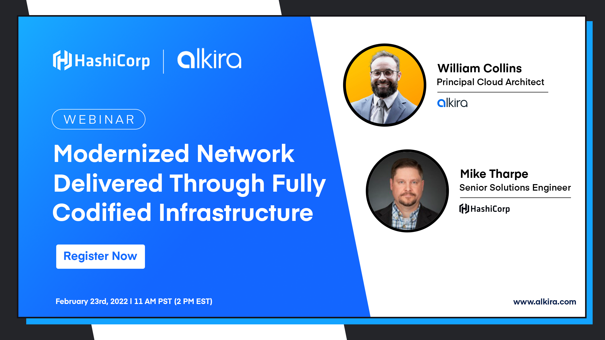

## [Watch on YouTube](https://www.youtube.com/watch?v=KWDQ1ycQowg)

### Description
Developers have shifted focus on making applications more portable and 92% of enterprises have a multi-cloud strategy. Infrastructure-as-Code backed by sound DevOps principles is the de facto method for delivering this infrastructure and demand has increased for speed, scale, and simplicity on the network across clouds. In this joint webinar hosted by Alkira and HashiCorp, we will examine why automation is imperative for transforming businesses and how organizations are using these dynamic platforms together to create a competitive advantage in the market.