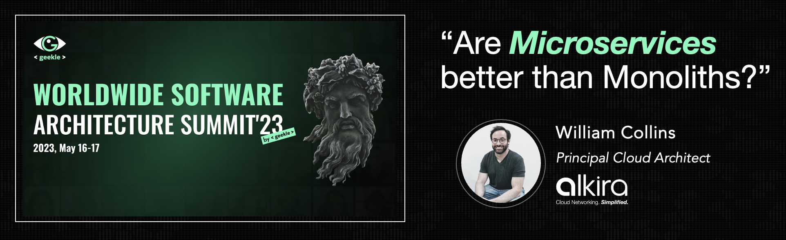

## Overview
This repo contains the _slide deck_ used for [The Worldwide Software Architecture Summit'23](https://events.geekle.us/wsas23/). You can find the entire recorded session at [https://www.youtube.com/watch?v=emiuD2YW5o8](https://www.youtube.com/watch?v=emiuD2YW5o8).

### Abstract:
> The year is 2023, and Kubernetes is wreaking havoc on software delivery as we know it. Modernization initiatives are commencing to decompose applications into Microservices, but they are coming out the other end as distributed monoliths. Many large businesses today utilize technologies stacked over decades, including mainframes. You could even say that COBOL, at the ripe age of 64, still powers the global economy. In this talk, we will examine the polarization of Kubernetes and Microservices. Is it a zero-sum game, or is the real world destined to merge many different patterns and solutions in organized chaos forever?