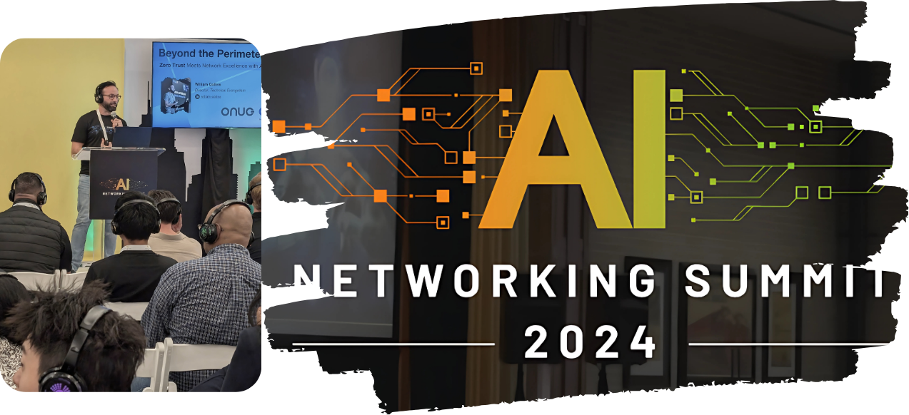

## Beyond the Perimeter: Zero Trust Meets Network Excellence with Alkira ZTNA
This repo contains the _slide deck_ used for [ONUG - AI Networking Summit](https://onug.net/fall-2024/ai-networking-summit-fall-2024/). You can find the entire recorded session at [https://www.youtube.com/watch?v=xiC9EORy4TE](https://www.youtube.com/watch?v=xiC9EORy4TE).

### Abstract:
Today, enterprises face the dual challenge of securing their distributed workforce and applications while maintaining high-performance networking to meet business demands. Traditional VPNs and perimeter-based security models fall short, while many Zero Trust solutions focus solely on user-to-app scenarios, neglecting the broader picture of enterprise connectivity.

Enter Alkira ZTNA – a pragmatic approach that marries Zero Trust principles with Alkira’s Network Infrastructure-as-a-Service Platform. In this talk, we’ll dive into how Alkira ZTNA provides a unified platform for secure and efficient access across all traffic flows: user-to-app, app-to-app, and user-to-internet. Elevate network security without sacrificing performance with a decentralized architecture that optimizes user experience while maintaining centralized policy control. 