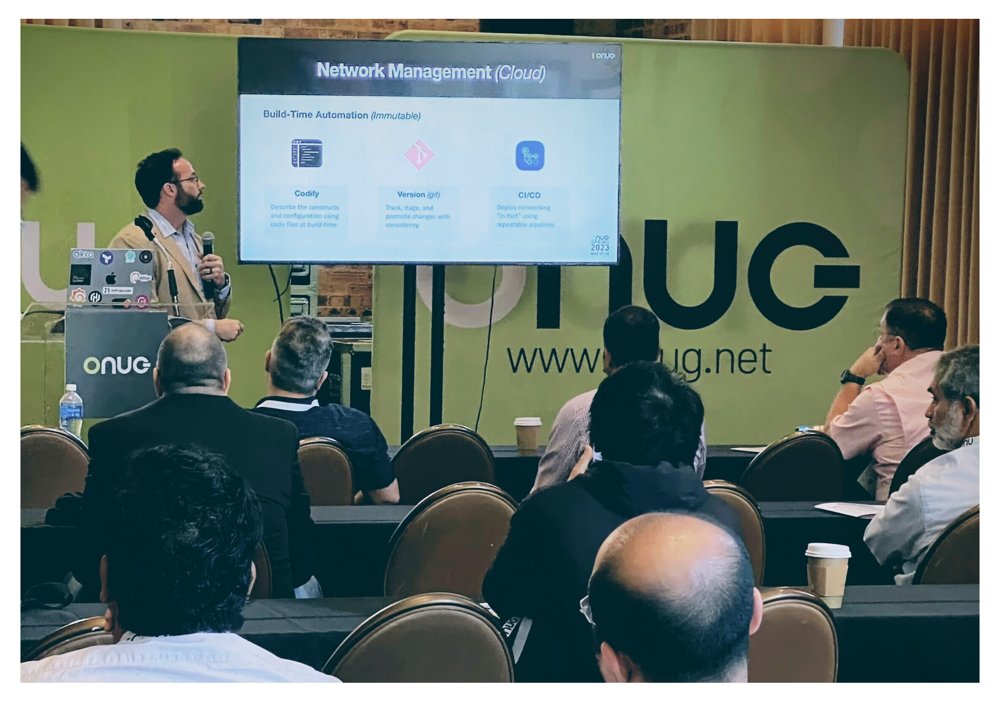

### Overview
This repo contains the _slide deck_ and code used at this [ONUG 2023 session.](https://onug.net/events/onug-training-featuring-alkira-using-modern-practices-and-tools-to-operate-networking-in-the-cloud/) You can find the entire recorded session at [https://vimeo.com/837406953](https://vimeo.com/837406953).



## Session: Using Modern Practices and Tools to Operate Networking in the Cloud
As the public cloud continues to gain momentum, the gap broadens between operating traditional networks and cloud networks. A different set of skills and tooling is required to deploy and maintain network infrastructure. In this course, you will gain an understanding of the following:
- The value proposition of _Infrastructure-as-Code_
- Building basic AWS networking with _Terraform and Python_
- Expanding the scope to multi-cloud with _Network-as-a-Service_
- Benefits of standardized toolchain for managing infrastructure

### Provisioning Infrastructure with Terraform
```hcl
terraform init
terraform plan -out=tfplan
terraform apply "tfplan"
```

### Destroying Infrastructure with Terraform
```hcl
terraform destroy
```

### Provisioning Infrastructure with Python Script
```shell
python3 create_vpc.py
```

### Destroying Infrastructure with Python Script
```shell
python3 delete_vpc.py
```

## :warning: Note
For the _Python_ script in this demo, I used a [long-term credentials file](https://docs.aws.amazon.com/cli/latest/userguide/cli-configure-files.html) for simplicity. This is not recommended for _production_.